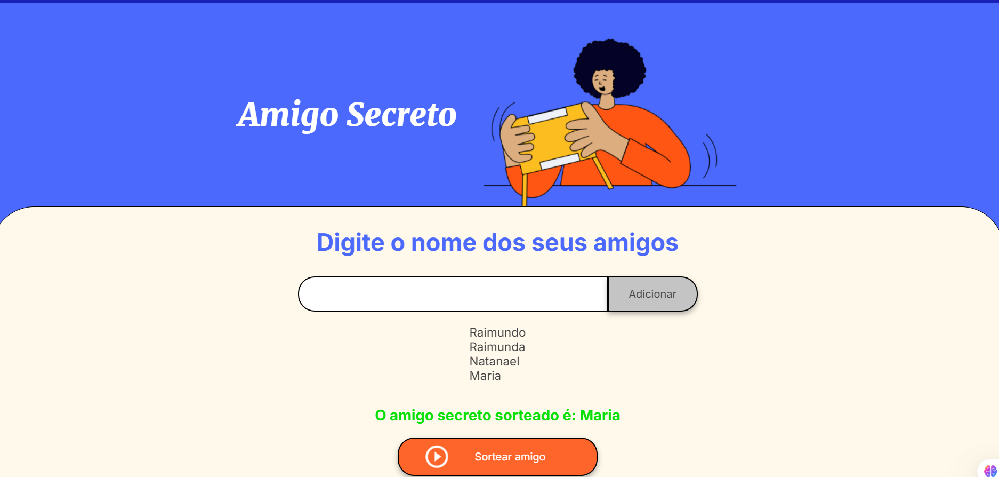

# Jogo do amigo secreto

## Criado por: Glaudencio da Costa Meneses

 

# Acesse a demonstração do projeto funcionando [aqui](https://glaudencio12.github.io/challenge-amigo-secreto/)

# Descrição do jogo

O objetivo do jogo é sortear um amigo secreto de acordo com uma lista de amigos inseridos pelo usuário. O nome da pessoa que será o amigo secreto é escolhido aleatoriamente e exibido na tela.

# Como baixar o jogo?

- Baixe o jogo em forma de arquivo zip
- Descompacte o arquivo zip
- Abra o projeto no seu vscode
- Execute o arquivo index.html e, pronto, agora você pode jogar

# Como jogar?

1. Insira os nomes dos amigos na lista de amigos.
2. Clique no botão "Adicionar" para adicionar o amigo à lista.
3. Clique no botão "Sortear amigo secreto" para sortear um amigo secreto.
4. O nome do amigo secreto sera exibido na tela.

